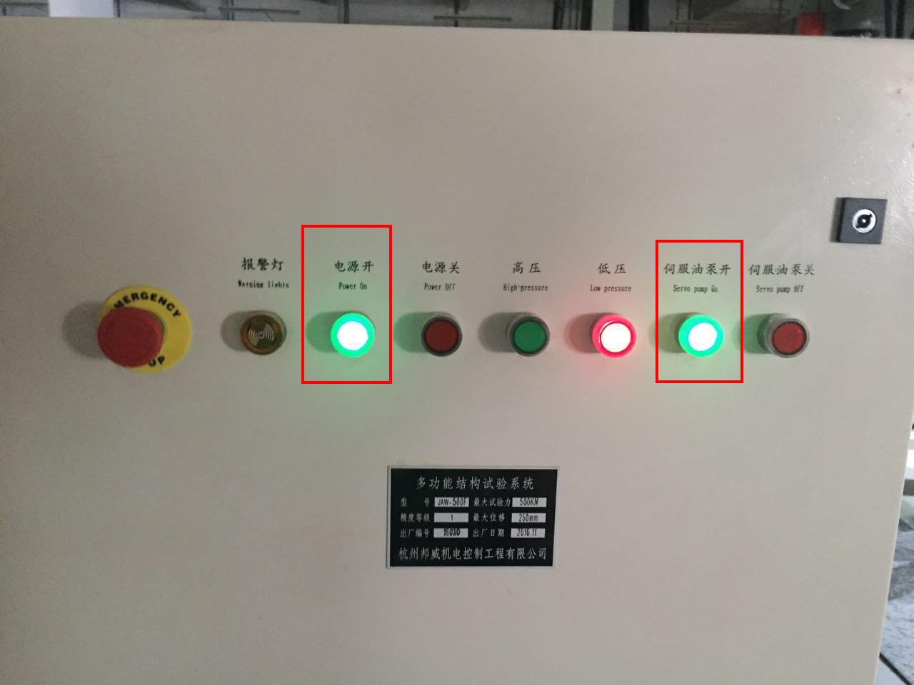

500kN邦威试验机操作指南
===============================================

试验机介绍
------------------

500kN邦威试验机位于木结构试验室外，可以完成抗拉、抗压、抗弯性能试验。试验机外观如图所示。

 .. image:: img/bw2/look.jpg

	 
试验机有关规格参数如下表

试验机使用说明
----------------

应变片的命名规则如图：

试验机的操作顺序为：

1. 打开电脑 
#. 打开试验软件 
#. 开启控制器开关 
#. 开启油泵，油源低压 
#. 打开阀台，油源高压 
#. 安装试件 
#. 新建试验数据库和试件 
#. 开始试验 
#. 存储数据 
#. 结束试验 

下面对上述步骤一一说明。

打开电脑
~~~~~~~~~~~

打开电闸，打开显示器。打开电脑和控制器机柜门（门把手下部的按钮下拉，然后逆时针旋转90度，即可打开）。旋转机箱上的钥匙打开挡板，可以看到电脑机箱的电源开关。轻按电源开关，即可打开电脑。如图所示

打开试验软件
~~~~~~~~~~~~~~

Windows系统启动完成后，直接进入试验软件。软件名为 ``POPWARE_JYAWWAW.exe`` 。打开软件后有 ``材料试验`` 、``结构试验``、 ``退出`` 三个选项，如图所示

在进行拉、压试验时，请选择 ``材料试验`` ，在进行受弯试验时，请选择 ``结构试验`` 。两种界面的主要区别为力和位移的符号不同。在 ``材料试验`` 中，向上位移为正，试件受拉力为正。在 ``结构试验`` 中，向下位移为正，试件受压力为正。另外在一些控制方式上 ``材料试验`` 和 ``结构试验`` 有很小的区别。本教程中以 ``材料试验`` 为例进行介绍。

.. note::　在一些与试验机有关的操作之前，须先开启软件。同理，试验结束后，在试验机关闭好后，再关闭软件。否则将造成未知错误。

开启控制器开关
~~~~~~~~~~~~~~~~~~~~~~~~

进入软件后，在机柜中打开控制器开关，这时开关亮红灯。打开开关后，软件中力、位移的读数会发生变化，这是正常现象。此时位移的读数为油缸的绝对位置。当油缸在底部时，读数为0，在顶部时，读数为250左右。（如果进入软件的 ``材料试验`` 模块，读数相反，即油缸在顶部时读数为0， 在底部时读数为250左右。

开启油泵，油源低压
~~~~~~~~~~~~~~~~~~~~~~~~~~~~~

刚才的操作都在控制室中进行。现在请走出控制室，开启油泵。油泵位于试验机的北侧（靠外）。首先按 ``电源开`` ，打开油泵电源，然后按 ``伺服油泵开`` ，打开油泵。如图所示

.. warning:: 请不要按 ``高压`` 按钮。下面步骤中会介绍通过软件控制油源高压。

打开阀台，油源高压
~~~~~~~~~~~~~~~~~~~~~~~~~~

回到控制室，在软件的左上角有 ``阀台控制`` 按钮，点击，出现 ``阀台及油源控制`` 对话框。首先单击左侧的 ``阀台打开`` 按钮，打开阀台，然后在右侧的 ``压力控制`` 区域，单击 ``油源高压`` ，等待5秒，在油源状态提示中可以看到 ``油源高压状态`` 几个红字。这时可以关闭对话框。如图所示。

安装试件
~~~~~~~~~~~

1. 抗拉试件

对于拉伸试件，试验机配置了夹具和相应的钳口，可以对板状和圆柱状试件进行拉伸试验。钳口共四套，其适用范围如下表所示。

试验机有两个自由度，分别是横梁和油缸。在试验之前，先操作软件，把油缸置于中部。方法是，在软件左侧选择 ``手动`` 选项卡，速度选择100，通过 ``上箭头`` 、 ``下箭头`` 和 ``stop`` 键来控制油缸移动，观察上方的位移读数，使之达到125。如果在某个位移将位移清过零，位移读数不是油缸的绝对位置，可以单击菜单栏中的``监控``菜单，在弹出的窗口中观察 ``绝对位置`` 选项卡中的读取。如图所示

调节好油缸后，到试验机边调节横梁的位置。试验机边有遥控器如图所示

先将旋钮拨至 ``横梁松开`` ，然后通过按 ``横梁上升`` 和 ``横梁下降`` 按钮使横梁到达合适的位置。将试件放入，按 ``上夹紧`` 和 ``下夹紧`` 按钮控制钳口夹紧。最后将旋钮拨回 ``横梁抱紧`` ，会听到相应的声音。

.. note:: 在上下夹紧的过程中，夹头会产生竖直方向的位移，由于摩擦，会引于一个不可避免的轴向力。如果在横梁未抱紧状态下夹紧钳口，试验机的刚度相对较小，分担到试件上的力会相应较小。另外，钳口的抱紧力很大，且不可调节，一般不适用于直接夹紧木材。实验表明，在该试验机上，木材试件的破坏会出现在钳头端部两两向应力处，无法达到预期的试验效果。

.. warning:: 遥控机的按键非常灵敏，在使用时注意安全。绝对不可把手伸入钳口所在范围。由于夹紧时钳口会外伸，也要特别注意。

2. 抗压试件

如果需要进行抗压试验，请联系试验室管理员更换加载头。

.. warning:: 抗拉加载头与抗压加载头要分别对应受拉试验和受压试验，不能相互取代。否则会造成试验失败和仪器损坏。抗拉夹具只能用于受拉试件夹紧，而不能用于受压试件。

3. 抗弯试件

如果需要进行抗弯试验，请联系试验室管理员更换加载头。试验机配有转换梁和转动铰支座，可以进行四点加载试验。支座钢墩的位置如需调节，请联系试验室管理员。

新建试验数据库和试件
~~~~~~~~~~~~~~~~~~~~~~~~~~~~~

试件安装好后，可以准备开始试验。为了记录试验数据，需要进行下面的操作。

首先新建试验数据库。本机软件的试验数据库为Access数据库格式。试验数据库可以保存多个表，每个表中又可以保存多个试验。不建议建立过多的试验数据库。为了方便管理，每个试验人员可以建立一个试验数据库。**请以试验人员的姓名为数据文件名**。

建立试验数据库的方法：在软件的右下部，单击 ``结果数据库`` 选项卡，在最右下角，有一个不甚明显的按钮 ``数据库设置`` 。如图所示

单击 ``数据库设置`` ，弹出对话框。选择以您名字命名的数据库。如果没有，请单击 ``新建`` 按钮新建数据库。位置请放在默认路径中。建好数据库后，在 ``数据表操作`` 部分单击 ``新建`` 按钮，新建一个数据表，选择所需保存的字段（一般全选），按自己的方式命名数据表。如图所示

建立好数据表后，还要输入试件信息。可以在试验之前把所有试件信息输好，也可以每做一个试件之前输入试件信息。单击菜单栏下方的 ``试样信息`` 按钮，在弹出的对话框中输入试件信息，按 ``添加`` 后，试件信息就会出现在右侧的数据表中。如果有多个试件，单击数据表上方靠左的 ``添加试样`` 创建，也可以在 ``试样信息设定`` 对话框中批量添加。对于当前试件，在数据表最左侧有一个黑色的三角键头标出。 ``试样信息设定`` 对话框和数据表如图所示。

在右侧的数据表下方有一个选择框 ``试验结束后自动进入数据库`` 。这个选择框如果选中，则试验结束后，数据会自动存入数据库的当前试件记录中。如果不选中，则需要手动入库。在试验结束后单击数据表上方中间的 ``手动入库`` ，将试验结果记录进数据库。

开始试验
~~~~~~~~~~~~~

在软件界面的左侧，有两个很大的按钮，分别为 ``试验开始`` 和 ``试验停止`` 。这两个按钮并不是控制油缸是否开始加载，而是控制是否采集和记录试验数据的。对于油缸的控制，应在下方的 ``手动`` (一般不使用)、 ``位移`` 、 ``负荷`` 、 ``程控`` 四个选项卡中设定。这里以 ``位移`` 控制为例，可以输入 ``速度`` 和 ``目标值`` 两个控制参数。

首先单击 ``开始试验`` ，这时试验力和位移都会自动清零。（此前也可以单击数字右上角的 ``0.0`` 按钮清零，效果一样）。同时开始记录数据。这时再单击 ``位移`` 选项卡中的 ``应用`` 按钮，即可开始加载。在加载过程中可以调节加载速度，单击 ``应用`` 即可生效。

在加在过程中，可以通过软件右侧的 ``图像`` 选项卡观察试验数据。单击菜单栏下方的 ``曲线`` 图标，可以设置曲线的信息，如可以显示力或位移的时程，也可以显示力-位移关系。

达到破坏判别条件后，试验机自动停止加载，自动跳入 ``试验停止`` 状态，试验结束。如果中途停止试验，可以在控制选项卡中单击 ``暂停`` ，然后单击 ``试验停止`` 按钮。

试验结束后，最好立即数据入库。如上节所述，如果选中了 ``试验结束后自动进入数据库`` ，则数据库中已经可以看到结果。如果没有选中，请点击数据表上方的 ``手动入库`` 按钮入库。数据记录的最后一项为试验数据文件名，根据这一文件名可以找到相应的试验数据文件。试验全部结束后，请将数据库和对应文件一同导出。

存储数据
~~~~~~~~~~~~~~~

为了保护控制电脑，请使用试验室专用U盘在试验室现场拷出数据到个人电脑，并在数据拷出后立即格式化U盘，或者使用个人格式化过的U盘拷取数据。如果没有携带个人电脑，也没有格式化过的U盘，请购买试验室提供的cd光盘刻录试验数据。任何人不得将未格式化过的个人U盘插入该电脑。对于不遵守本规定的试验人员要承担相应的责任。

存储数据时，请留意数据表中显示的结果文件名，同时将以您名字命名的数据库和相应的所有结果文件拷出。对于Access数据库可以通过Access软件打开，也可以通过Excel软件导入。数据文件可直接用文本编辑器打开。

结束试验
~~~~~~~~~~~~~~~~~~~~

试验结束后，首先打开钳口，拆卸试件。然后打开软件中的 ``阀台控制`` 对话框，先单击 ``油源低压`` ，再单击 ``关闭阀台`` 。完成后，到油泵处，先关闭伺服油源，再关闭油泵电源。这些操作完成后，关闭机柜中的控制器开关，然后方可退出软件，关闭电脑，关闭电闸。试验结束。

